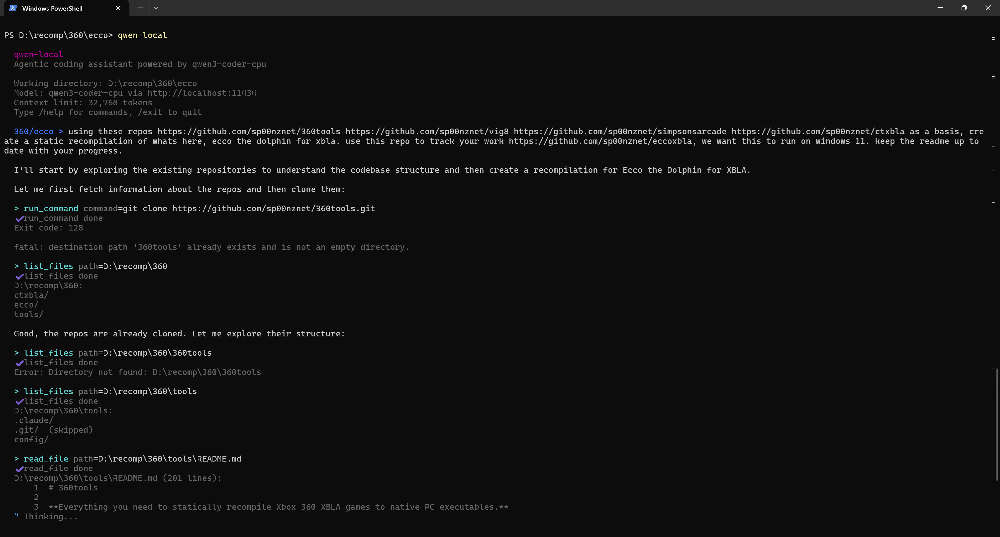

# qwen-local

**Your own AI coding assistant, running entirely on your machine. No API keys. No cloud. No limits.**

qwen-local is an agentic coding CLI — like having a senior dev pair-programming with you in your terminal. It reads your files, writes code, runs commands, searches your codebase, and plans out complex tasks. All powered by [Qwen3-Coder](https://ollama.com/library/qwen3-coder) running locally through [Ollama](https://ollama.com).



```
  qwen-local
  Agentic coding assistant powered by qwen3-coder-cpu

  Working directory: D:\myproject
  Model: qwen3-coder-cpu via http://localhost:11434
  Context limit: 32,768 tokens
  Type /help for commands, /exit to quit

  myproject > Can you look at the auth module and add rate limiting?

  > read_file path=src/auth/login.js
  ✔ read_file done

  > read_file path=src/auth/middleware.js
  ✔ read_file done

  I see the auth flow. I'll add a simple in-memory rate limiter
  to the login endpoint...

  > edit_file path=src/auth/middleware.js old_string=... new_string=...
  ✔ edit_file done

  > run_command command=npm test
  ✔ run_command done

  Done! I've added rate limiting to the login middleware.
  All 14 tests pass.

  2.3s | context: [======              ] 31% | 12 msgs | 4 tool calls
```

---

## Why qwen-local?

| | Cloud AI | qwen-local |
|---|---|---|
| **Privacy** | Your code goes to someone's server | Everything stays on your machine |
| **Cost** | $20/month or pay-per-token | Free forever |
| **Speed** | Fast but needs internet | Works offline, no latency jitter |
| **Limits** | Rate limits, usage caps | Run it as much as you want |
| **Control** | Their model, their rules | Your hardware, your model |

---

## Quick Start

### One-line install

**Windows** (PowerShell):
```powershell
powershell -ExecutionPolicy Bypass -File installer\install-windows.ps1
```
Or just double-click `installer\install.bat`.

**Linux** (Debian/Ubuntu):
```bash
chmod +x installer/install-linux.sh && ./installer/install-linux.sh
```

The installer handles everything — Ollama, Node.js, the model, PATH setup. It asks you two questions (where to install, CPU or GPU) and does the rest.

### Manual install

If you already have Ollama and Node.js:

```bash
cd qwen-local
npm install
npm link

# Pull the model (pick one)
ollama pull qwen3-coder-cpu   # CPU — works on any machine
ollama pull qwen3-coder       # GPU — needs NVIDIA + CUDA
```

### Run it

```bash
cd ~/my-project
qwen-local
```

That's it. You're in.

---

## Features

### It actually does things

This isn't a chatbot. When you say "add a login page," it reads your existing code, figures out the patterns, writes the files, and runs your tests. It has 10 built-in tools:

| Tool | What it does |
|------|-------------|
| `read_file` | Reads files with line numbers (supports line ranges) |
| `write_file` | Creates new files or rewrites existing ones |
| `edit_file` | Surgical find-and-replace edits |
| `run_command` | Runs shell commands (git, npm, make, etc.) |
| `list_files` | Lists directory contents (with recursive mode) |
| `search_files` | Regex search across your codebase (like grep) |
| `find_files` | Find files by glob pattern (like `**/*.ts`) |
| `save_memory` | Persist notes/state to memory for future sessions |
| `read_memory` | Read previously saved memory |
| `delete_memory` | Clear saved memory |

### Plan Mode

Not sure about a change? Toggle plan mode and the model will explore your codebase and design a plan — without touching anything.

```
  myproject > /plan

  PLAN MODE ON
  The model will explore and plan without making changes.
  File writes and state-changing commands are blocked.

  myproject [PLAN]  > Refactor the database layer to use connection pooling

  > list_files path=src/db recursive=true
  ✔ list_files done

  > read_file path=src/db/connection.js
  ✔ read_file done

  > search_files pattern=createConnection
  ✔ search_files done

  Here's my plan:

  1. **src/db/pool.js** (new) — connection pool manager using generic-pool
  2. **src/db/connection.js** — replace direct connections with pool.acquire()
  3. **src/db/queries.js** — update 4 functions to release connections after use
  4. **package.json** — add generic-pool dependency

  Risk: The batch-import script holds connections for 30+ seconds.
  We should add a separate pool config for long-running operations.

  Ready to implement? Toggle plan mode off with /plan.
```

### Context Management

Long conversations don't crash — they get compacted. qwen-local tracks your token usage and automatically summarizes older messages when the context window fills up. You see it happening:

```
  [Context compacted: 47 messages → 18 messages]
```

Every response shows your context usage so you always know where you stand:

```
  2.1s | context: [============        ] 58% | 24 msgs | 7 tool calls
```

Use `/compact` to do it manually, or `/status` for the full breakdown.

### Memory — State That Survives Sessions

Tell the model to "save your state to memory" and it writes persistent notes that get loaded automatically next time. It's not a conversation replay — it's the model's curated understanding of what matters.

```
  myproject > Save your state to memory

  > read_memory scope=all
  ✔ read_memory done

  > save_memory scope=project mode=replace content=...
  ✔ save_memory done

  Done! I've saved:
  - Current task: Adding rate limiting (completed, tests pass)
  - Next steps: Add threshold configuration
  - Key files: src/auth/middleware.js, src/auth/login.js
```

Next session, the model already knows what's going on:

```
  myproject > What were we working on?

  Based on my memory, we finished adding rate limiting to the
  auth module. The next step was adding configuration for the
  rate limit thresholds. Want me to continue?
```

Memory comes in two scopes:
- **Project** (`.qwen-local/MEMORY.md`) — shareable via git, team knowledge
- **Global** (`~/.qwen-local/memory/MEMORY.md`) — your personal preferences across all projects

### Save and Load Conversations

Working on something complex? Save your progress and come back later.

```
  myproject > /save auth-refactor
  Conversation saved: ~/.qwen-local/conversations/auth-refactor.json

  # Later...
  myproject > /load auth-refactor
  Conversation loaded (34 messages).

  myproject > Where were we? What's left to do?
```

### Multiline Input

Paste code blocks without everything breaking:

```
  myproject > """
  Here's the error I'm getting:

  TypeError: Cannot read properties of undefined (reading 'map')
      at UserList (src/components/UserList.jsx:14:22)
      at renderWithHooks (node_modules/react-dom/...)
  """
```

Start with `"""` or `'''`, paste whatever you want, end with the same delimiter.

### Skills — Reusable Workflows

Skills are slash commands that expand into full multi-step prompts. They're like macros for your AI assistant.

```
  myproject > /commit
  Running skill: /commit
  Stage & commit with AI-generated message

  > run_command command=git status
  ✔ run_command done

  > run_command command=git diff
  ✔ run_command done

  > run_command command=git add src/auth/middleware.js
  ✔ run_command done

  > run_command command=git commit -m "Add rate limiting to login endpoint"
  ✔ run_command done

  Committed! 2 files changed.
```

**8 built-in skills** ship out of the box:

| Skill | What it does |
|-------|-------------|
| `/commit [msg]` | Stage and commit with an AI-written message |
| `/review [branch]` | Review code changes for bugs and style |
| `/test [cmd]` | Run tests, fix failures, re-run |
| `/explain <target>` | Explain how a file or function works |
| `/fix <error>` | Diagnose and fix a bug from an error message |
| `/refactor <target>` | Refactor code without changing behavior |
| `/deps` | Analyze project dependencies |
| `/init` | Explore and summarize the entire project |

**Create your own** with `/skill create`:

```
  myproject > /skill create

  Skill name: deploy
  Description: Deploy to staging or production
  Arguments hint: [environment]

  Enter the prompt template (type END when done):
  > Deploy to {{#if args}}{{args}}{{else}}staging{{/if}}:
  > 1. Run the tests first.
  > 2. Push the current branch.
  > 3. Run the deploy script.
  > END

  Save as (u)ser or (p)roject skill? p

  Skill "/deploy" created!
```

Skills can be **user-scoped** (`~/.qwen-local/skills/`, available everywhere) or **project-scoped** (`.qwen-local/skills/`, shareable via git so your whole team gets them).

### Model Hot-Swap

Try different models without restarting:

```
  myproject > /model qwen3-coder        # switch to GPU model
  Model changed to: qwen3-coder

  myproject > /model deepseek-coder-v2  # or try a different model entirely
  Model changed to: deepseek-coder-v2
```

Any model Ollama has works. Mix and match.

---

## All Commands

| Command | Description |
|---------|-------------|
| `/help` | Show all commands |
| `/exit` | Quit |
| `/clear` | Wipe conversation history and start fresh |
| `/plan` | Toggle plan mode (read-only exploration) |
| `/status` | Show token usage, model info, session stats |
| `/cd <dir>` | Change working directory |
| `/save [name]` | Save conversation to disk |
| `/load [name]` | List or load saved conversations |
| `/compact` | Manually compress conversation history |
| `/model <name>` | Switch Ollama model |
| `/config` | Show current configuration |
| `/memory` | Show saved memory |
| `/memory status` | Memory file paths and sizes |
| `/memory clear <scope>` | Clear memory (project/global/all) |
| `/skills` | List all available skills |
| `/skill create` | Create a new skill interactively |
| `/skill show <n>` | View a skill's prompt template |
| `/skill edit <n>` | Edit a skill |
| `/skill delete <n>` | Delete a user/project skill |
| `/<skillname>` | Run any skill (e.g. `/commit`, `/test`) |

---

## Configuration

Settings live at `~/.qwen-local/config.json`:

```json
{
  "model": "qwen3-coder-cpu",
  "ollamaUrl": "http://localhost:11434",
  "maxContextTokens": 32768,
  "compactThreshold": 0.75,
  "commandTimeout": 60000,
  "maxToolResultSize": 8000,
  "confirmDestructive": true
}
```

Edit it directly or use `/model` to change models on the fly.

---

## CPU vs GPU

| | CPU Mode | GPU Mode |
|---|---|---|
| **Model** | `qwen3-coder-cpu` | `qwen3-coder` |
| **Requirements** | Any modern CPU, 8GB+ RAM | NVIDIA GPU, CUDA, 8GB+ VRAM |
| **Speed** | Slower (but totally usable) | Much faster |
| **Setup** | Just works | Need CUDA drivers |

The installer asks which you want. You can switch anytime by pulling a different model and using `/model`.

---

## Requirements

- **Ollama** — [ollama.com](https://ollama.com) (the installer handles this)
- **Node.js** v18+ — [nodejs.org](https://nodejs.org) (the installer handles this too)
- **RAM** — 8GB minimum, 16GB recommended
- **Disk** — ~5GB for the model

---

## Project Structure

```
qwen-local/
├── bin/qwen-local.js           # CLI entry point
├── src/
│   ├── agent.js                # Agentic loop + Ollama streaming
│   ├── cli.js                  # Interactive REPL + all commands
│   ├── config.js               # Persistent settings
│   ├── context.js              # Token tracking + auto-compaction
│   ├── conversation.js         # Save/load conversations
│   ├── memory.js               # Persistent memory across sessions
│   ├── prompt.js               # System prompts (normal + plan mode)
│   ├── skills.js               # Skill system (built-in + user + project)
│   ├── tool-definitions.js     # Tool schemas for the model
│   ├── tools.js                # Tool implementations
│   └── utils.js                # Colors + formatting
├── installer/
│   ├── install.bat             # Windows one-click installer
│   ├── install-windows.ps1     # Windows PowerShell installer
│   ├── install-linux.sh        # Debian/Ubuntu installer
│   ├── uninstall-windows.ps1   # Windows uninstaller
│   └── uninstall-linux.sh      # Linux uninstaller
└── docs/                       # Documentation
```

---

## How It Works

qwen-local runs a simple but powerful loop:

```
You type something
    → Your message + system prompt + tool definitions sent to Ollama
        → Model responds with text and/or tool calls
            → If tool calls: execute them, send results back, loop
            → If just text: display it, wait for your next message
```

The model sees your working directory, knows what tools it has, and decides what to do. It reads before it writes, handles errors, and chains multiple tools together to accomplish complex tasks. Just like a real developer would.

---

## Docs

Full documentation is in the [`docs/`](docs/) folder:

- [Getting Started](docs/getting-started.md) — Installation and first steps
- [Tools Reference](docs/tools.md) — All 10 tools explained in detail
- [Skills](docs/skills.md) — Built-in skills, creating your own, template language
- [Memory](docs/memory.md) — Persistent state across sessions
- [Plan Mode](docs/plan-mode.md) — How read-only exploration works
- [Context Management](docs/context-management.md) — Token tracking and compaction
- [Configuration](docs/configuration.md) — All settings explained
- [Architecture](docs/architecture.md) — How the agent loop works under the hood

---

## Contributing

This project is built to be simple and hackable. The whole thing is ~1200 lines of JavaScript with zero heavy frameworks. Want to add a tool? It's one function in `tools.js` and one schema in `tool-definitions.js`. Want to add a skill? Drop a JSON file in `~/.qwen-local/skills/`. Want to change the model's behavior? Edit `prompt.js`.

---

## License

MIT — do whatever you want with it.
